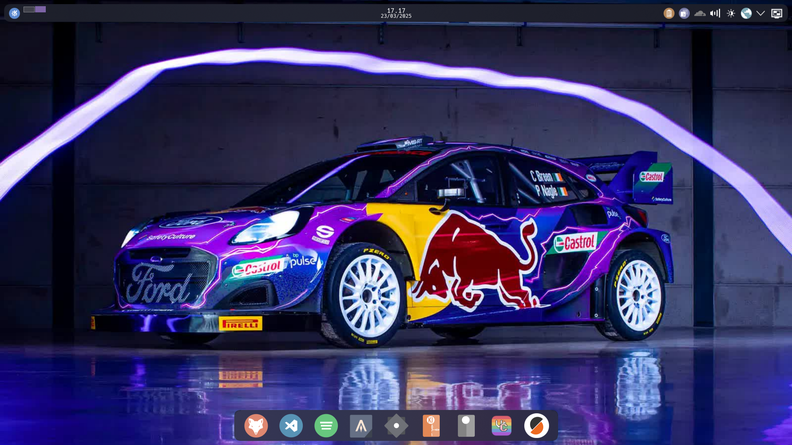

# Dhupee's Unified Dotfiles

<!--toc:start-->
- [Dhupee's Unified Dotfiles](#dhupees-unified-dotfiles)
  - [What is this](#what-is-this)
  - [Screenshots](#screenshots)
  - [File Structure](#file-structure)
  - [Installation](#installation)
    - [Linux/NixOS](#linuxnixos)
    - [Windows](#windows)
  - [Tools I use in this dotfiles](#tools-i-use-in-this-dotfiles)
  - [References for me](#references-for-me)
  - [To-Do List](#to-do-list)
<!--toc:end-->

> [!IMPORTANT]
> I USE NIXOS, BTW

## What is this

This is my current dotfiles that I will use in the next few years or might be my last dotfiles repo, this repo is unified all of the tools i use, not only for NixOS, Android, WSL and Windows in limited sense, and maybe hopefully servers and Macs if i have money.

By combining both [Chezmoi](https://www.chezmoi.io/), [NixOS](https://nixos.org/), and [Home-Manager](https://github.com/nix-community/plasma-manager), not only I benefit from NixOS/Home-Manager reproducability for my Linux/WSL/Android config, using Chezmoi allows me to use my dotfiles on setups that don't/can't use Nix like Windows or Random PCs/Servers that shouldn't be littered with Nix immutability.

## Screenshots



## File Structure

This is how I structure my nix-configs currently, it might will have few more diretories in the future.

the naming scheme is auto generated by Chezmoi, so don't be surprised.

on the front you will have:

- `AppData`, Windows equivalent of `.config/` or `.local` I think.
- `dot_config`, Config files, for now it only have powershell
- `dot_distrobox-recipe`, my recipe for distroboxes I might use, the command is long so having that is neat.
- `dot_scripts`, my scripts, it has bash and powershell,some of them are carry over from my old dotfiles.
- `dot_torrents`, we are a pirate!!
- `dot_node-red`, node-red stuff for IoT
- `mutable-configs`, configs that is mutable, not worth it to be carried to home directory since it will changed a lot, will be symlinked by the home-manager or other methods depend on what I need.
- `dot_nix-configs`, my actual NixOS configs.
- `private_dot_secrets`, well...encrypted files, configs, secrets
- `private_dot_ssh`, obviously...my ssh key
- `dot_zellij-layouts`, this is intended for template for layouts for zellij but havent been able to mastered it yet.
- `Templates`, templates of files...maybe not a lot that I added atm.
- `Wallpapers`, Waifu and car picture for Wallpapers

then when it comes to my actual `.nix-configs`, the directories looks like this.

- `aliases`, my aliases...also carried from my old dotfiles.
- `configs`, mostly my configuration files of packages, tried not to use nix for this so I can use it on non Nix systems.
- `droids`, configurations for `Nix On Droid`, NixOS but for Android (a Termux-based app)
- `home`, my home-manager configs, tried to seperate from systems as much as possible
- `linux`, my systems configs for NixOS
- `machines`, mostly for backups but it's collection of hardware-configurations.
- `modules`, modules of nix configs, seperated by systems and home-manager ofc.
- `theming`, modules for my ricing, has Gnome, KDEPlasma 6, maybe Hyprland if I want a neckbeard.
- `users`, modules for users, if there's more than me, or if I need a user for specific machines.
- `wsl`, modules specifically for NixOS config on Windows Subsystem for Linux

This thing obviously can change overtime as this dotfiles grow, and I can forgot the directories.

## Installation

### Linux/NixOS

ofc, I will assumed you to have Nix or NixOS installed in your linux systems

run this command to get my dotfiles:

```bash
nix-shell -p chezmoi git --run "chezmoi init dhupee"
```

then you add my Age key to the home directory, if you don't know, rob me. After that you run:

```bash
chezmoi apply
```

This will decrypt encypted files, and send the directories to targeted place, then `switch` your NixOS and Home-Manager, in `.nix-configs` directory run this one by one:

```bash
sudo nixos-rebuild switch --flake .#nitro
home-manager switch --flake .#dhupee
```

that will rebuild the systems into `nitro` profile, and `dhupee` home-manager profile and that will bring every tooling and ricing I have on such profile.

if you want to use other profiles then go on, check [the flake.nix](./dot_nix-configs/flake.nix)

### Windows

for this it's simple, just add my age key file to the home, then just `chezmoi init dhupee` then `chezmoi apply`.

ofc, I will recommended you to use scoop to install shits.

## Tools I use in this dotfiles

- [Home Manager](https://github.com/nix-community/home-manager)
- [Determinate Nix Installer](https://github.com/DeterminateSystems/nix-installer)
- [Plasma Manager](https://github.com/nix-community/plasma-manager)
- [Nix On Droid](https://github.com/nix-community/nix-on-droid)
- [NixOS WSL](https://github.com/nix-community/NixOS-WSL)
- [Spicetify Nix](https://github.com/Gerg-L/spicetify-nix)
- [Nix Portable](https://github.com/DavHau/nix-portable)
- [NixOS-Generator](https://github.com/nix-community/nixos-generators/)
- [Scoop Package Manager](https://scoop.sh/)

## References for me

- [Awesome Nix](https://github.com/nix-community/awesome-nix)
- [Partitioning NixOS with Disko](https://jefftp.com/nixos-disko/)
- [Nix Shorts, A collection of short notes about Nix, down to what is immediately needed for users.](https://github.com/justinwoo/nix-shorts)
  - [Your First Derivation](https://github.com/justinwoo/nix-shorts/blob/master/posts/your-first-derivation.md)
- [Installing a Custom NixOS Image on a Raspberry Pi](https://blog.janissary.xyz/posts/nixos-install-custom-image)
- [Python and NixOS: A match made in hell](https://crescentro.se/posts/python-nixos/#solution-cheat-on-nixos)

## To-Do List

- [ ] NixOS profile specifically for Klipper Servers, for my 3D printer
- [ ] Live USB profile
- [ ] "Portable Linux" profile
