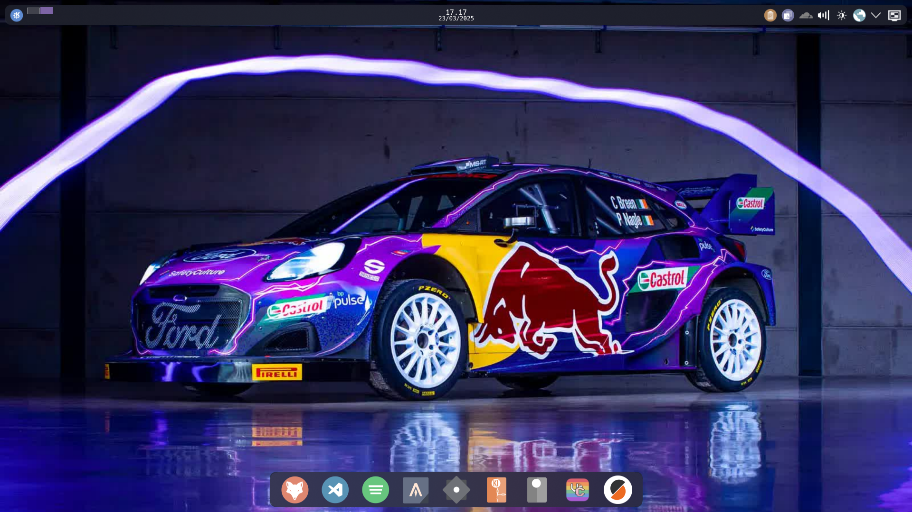

# Dhupee's Unified Dotfiles

<!--toc:start-->
- [Dhupee's Unified Dotfiles](#dhupees-unified-dotfiles)
  - [What is this](#what-is-this)
  - [Screenshots](#screenshots)
  - [File Structure](#file-structure)
  - [Installation](#installation)
    - [Linux / NixOS](#linux-nixos)
    - [Windows](#windows)
      - [Installing](#installing)
      - [Uninstalling Scoop as cleanly as possible](#uninstalling-scoop-as-cleanly-as-possible)
  - [Removing Dotfiles](#removing-dotfiles)
  - [Tools I use in this dotfiles](#tools-i-use-in-this-dotfiles)
  - [References for me](#references-for-me)
  - [To-Do List](#to-do-list)
<!--toc:end-->

> [!IMPORTANT]
> I USE NIXOS, BTW

## What is this

This is my current dotfiles that I will use in the next few years or might be my last dotfiles repo, this repo is unified all of the tools i use, not only for NixOS, Android, WSL and Windows in limited sense, and maybe hopefully servers and Macs if i have money.

By combining both [Chezmoi](https://www.chezmoi.io/), [NixOS](https://nixos.org/), and [Home-Manager](https://github.com/nix-community/plasma-manager), not only I benefit from NixOS/Home-Manager reproducability for my Linux/WSL/Android config, using Chezmoi allows me to use my dotfiles on setups that don't/can't use Nix like Windows or Random PCs/Servers that shouldn't be littered with Nix immutability.

---

## Screenshots



---

## File Structure

This is how I structure my nix-configs currently, it might will have few more diretories in the future.

the naming scheme is auto generated by Chezmoi, so don't be surprised.

on the front you will have:

| Directory                 | Description                                                                 |
|---------------------------|-----------------------------------------------------------------------------|
| `AppData`                 | Windows equivalent of `.config/` or `.local` I think                        |
| `dot_config`              | Config files, for now it only have powershell                               |
| `dot_distrobox-recipe`    | my recipe for distroboxes I might use, the command is long so having that is neat |
| `dot_scripts`             | my scripts, it has bash and powershell, some of them are carry over from my old dotfiles |
| `dot_torrents`            | we are a pirate!!                                                           |
| `dot_node-red`            | node-red stuff for IoT                                                      |
| `mutable-configs`         | configs that is mutable, not worth it to be carried to home directory since it will changed a lot, will be symlinked by the home-manager or other methods depend on what I need |
| `dot_nix-configs`         | my actual NixOS configs                                                     |
| `private_dot_secrets`     | well...encrypted files, configs, secrets                                    |
| `private_dot_ssh`         | obviously...my ssh key                                                      |
| `Templates`               | templates of files...maybe not a lot that I added atm                       |
| `Wallpapers`              | Waifu and car picture for Wallpapers                                        |

then when it comes to my actual `.nix-configs`, the directories looks like this.

| Directory   | Description                                                                 |
|-------------|-----------------------------------------------------------------------------|
| `aliases`   | my aliases...also carried from my old dotfiles                              |
| `configs`   | mostly my configuration files of packages, tried not to use nix for this so I can use it on non Nix systems |
| `droids`    | configurations for `Nix On Droid`, NixOS but for Android (a Termux-based app) |
| `home`      | my home-manager configs, tried to seperate from systems as much as possible |
|`image`| config for images for deploying NixOS to somewhere |
| `linux`     | my systems configs for NixOS                                               |
| `machines`  | `hardware-configuration.nix` backup and also hardware tweak for any machines I use|
| `modules`   | modules of nix configs, seperated by systems and home-manager ofc          |
| `theming`   | modules for my ricing, has Gnome, KDE Plasma 6, maybe Hyprland if I want a neckbeard | | `users`     | modules for users, if there's more than me, or if I need a user for specific machines | | `wsl`       | NixOS config on Windows Subsystem for Linux       |

This thing obviously can change overtime as this dotfiles grow, and I can forgot the directories.

---

## Installation

### Linux / NixOS

1. **Install Nix** - To use this Dotfiles, you need Nix to install Chezmoi. You can install it using the [Nix installer](https://nixos.org/download/).

    Then grab my configs:

    ```bash
    nix-shell -p chezmoi git --run "chezmoi init dhupee"
    ```

2. **Drop your Age key** - put the Age key where Chezmoi can read it and run chezmoi apply. That unlocks all the encrypted bits and installs my dotfiles.

    Finally, from the .nix-configs directory, fire off:

    ```bash
    sudo nixos-rebuild switch --flake .#nitro   # if you're on NixOS
    home-manager switch --flake .#dhupee        # always
    ```

    Swap the flake names if you're not nitro/dhupee – look inside flake.nix for alternatives. If you're on a non‑NixOS distro, skip the nixos-rebuild and just use Home‑Manager.

---

### Windows

#### Installing

Windows support is lighter than Linux/WSL, but Chezmoi makes it work. Setup takes four steps:

1. **Install Scoop** - This Dotfiles for Windows uses Scoop to install it's program, to install Scoop, run:

    ```powershell
    Set-ExecutionPolicy -ExecutionPolicy RemoteSigned -Scope CurrentUser
    Invoke-RestMethod -Uri https://get.scoop.sh | Invoke-Expression
    ```

    After this, you should be able to run `scoop install chezmoi` to install chezmoi from there

2. **Place your Age key** – Copy your `age.key` file into your home directory (`%USERPROFILE%`). Chezmoi needs it to decrypt your encrypted files.

3. **Bootstrap Chezmoi** – Open a terminal and initialise the repo:

   ```powershell
   chezmoi init dhupee
    ```

    Apply the dotfiles – Run:

    ```powershell
    chezmoi apply
    ```

    Install your applications – The dotfiles only handle configs; you supply the actual software. I recommend Scoop for most CLI tools and Winget for apps that need system integration.

> [!NOTE]
> This setup is intentionally kept minimal compared to my NixOS machines, but it gives you consistent scripts, aliases, and shell customisation on Windows.

#### Uninstalling Scoop as cleanly as possible

1. **Uninstall Scoop and all its apps**

   ```powershell
   scoop uninstall scoop
   ```

1. **Delete leftover directories** (if they still exist)

   ```powershell
   Remove-Item -Recurse -Force "$env:USERPROFILE\scoop" -ErrorAction SilentlyContinue
   Remove-Item -Recurse -Force "$env:USERPROFILE\.config\scoop" -ErrorAction SilentlyContinue
   ```

1. **Clean your `PATH` and Scoop‑related environment variables**
   Open *System Properties* → *Environment Variables* and remove:
   - Any user/system `Path` entries containing `scoop` (e.g., `%USERPROFILE%\scoop\shims`).
   - Any user/system variables named `SCOOP` or `SCOOP_GLOBAL`.

1. **Restart your terminal** for changes to take effect.

## Removing Dotfiles

Because Dotfiles is managed using Chezmoi, in order to remove dotfiles from **BOTH** Sources and Destination, run:

```powershell
chezmoi destroy
```

Then you can let it rip, remove Scoop or Nix, depending on the systems

## Tools I use in this dotfiles

- [Home Manager](https://github.com/nix-community/home-manager)
- [Determinate Nix Installer](https://github.com/DeterminateSystems/nix-installer)
- [Plasma Manager](https://github.com/nix-community/plasma-manager)
- [Nix On Droid](https://github.com/nix-community/nix-on-droid)
- [NixOS WSL](https://github.com/nix-community/NixOS-WSL)
- [Spicetify Nix](https://github.com/Gerg-L/spicetify-nix)
- [Nix Portable](https://github.com/DavHau/nix-portable)
- [NixOS-Generator](https://github.com/nix-community/nixos-generators/)
- [Scoop Package Manager](https://scoop.sh/)

## References for me

- [Arch Wiki](https://wiki.archlinux.org)
- [Awesome Nix](https://github.com/nix-community/awesome-nix)
- [Partitioning NixOS with Disko](https://jefftp.com/nixos-disko/)
- [Nix Shorts, A collection of short notes about Nix, down to what is immediately needed for users.](https://github.com/justinwoo/nix-shorts)
  - [Your First Derivation](https://github.com/justinwoo/nix-shorts/blob/master/posts/your-first-derivation.md)
- [Nix.Dev](https://nix.dev)
- [Installing a Custom NixOS Image on a Raspberry Pi](https://blog.janissary.xyz/posts/nixos-install-custom-image)
- [Python and NixOS: A match made in hell](https://crescentro.se/posts/python-nixos/#solution-cheat-on-nixos)
- [Nixpkgs Overlays](https://wiki.nixos.org/wiki/Overlays)
- [Librephoenix's NixOS Config Guide for Nerds and Other Cool People Youtube Playlist](https://www.youtube.com/watch?v=6WLaNIlDW0M&list=PL_WcXIXdDWWpuypAEKzZF2b5PijTluxRG)

## To-Do List

- [ ] NixOS profile specifically for Klipper Servers, for my 3D printer
- [ ] Live USB profile, packages as an custom ISO
